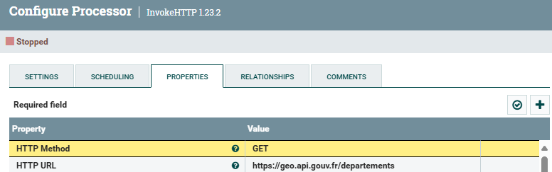
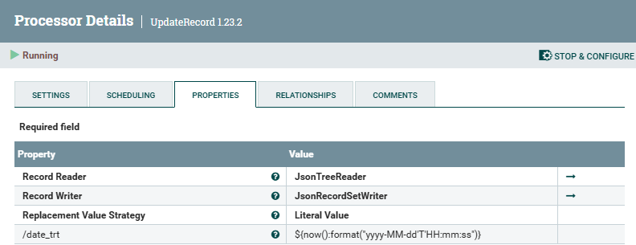
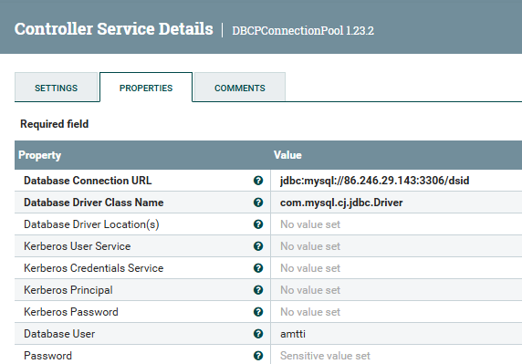
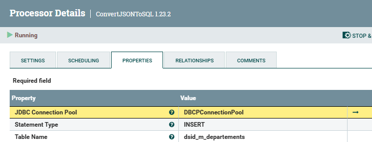
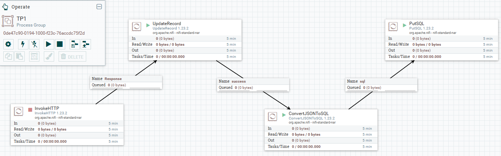

Auteur : Matthieu Ramond - M1 MIAGE Classique

[Index](./README.md)

# TP1 - Apache NiFi

1. **Décrire les étapes d'installation de Apache NIFI, les prérequis et les rôles de chacun des répertoires générés dans l'installation nifi**
   
    On télécharge l'archive nifi et on l'extrait.
    Prérequis :
    - Java JDK 8 ou supérieur (dans mon cas j'ai utilisé java JDK 11)
    - Avoir configuré JAVA_HOME dans les variables d'environnement et le PATH

    On lancera nifi via le fichier bin/run-nifi.bat

    Liste des répertoires :
    1. `bin` : Contient des exécutables de lancement de nifi
    2. `conf` : Contient tous les fichiers de configuration de nifi
    3. `content_repository` : Contient les fichiers passant temporairement par nifi (les données traitées par les processus)
    4. `database_repository` :
    5. `docs` : Contient les pages de documentations concernant chacun des processeurs
    6. `extensions`
    7. `flowfile_repository` : Stocke des informations sur les flowfiles
    8. `lib` : Contient les bibliothèques java utilisées par nifi (j'ai notamment dû y installer la bibliothèque permettant d'utiliser les drivers mysql)
    9. `logs` : Contient les logs (des rapports d'activité)
    10. `provenance_repository` : Contient l'historique de provenance des flowfiles
    11. `run` :
    12. `state` : 
    13. `work` : Contient des fichiers temporaires utilisés par les processus de nifi

2. **Appeler un web service, API et récupérer des données au format d'un tableau JSON**
   
    

3. 
4. **Modifier chaque enregistrement en Ajoutant un nouveau champ date/heure de traitement (date_trt)**

    

5. **Dans une base de données (PostgreSQL, MySQL, ou autre), Créer une table ayant les mêmes noms et types de champs que les enregistrements json de votre API (+ le nouveau champ date_trt)**

    ```SQL
    DROP TABLE IF EXISTS dsid_m_departements;

    CREATE TABLE IF NOT EXISTS dsid_m_departements (
        nom VARCHAR(255) NOT NULL,
        code VARCHAR(255) NOT NULL,
        codeRegion VARCHAR(255) NOT NULL,
        date_trt VARCHAR(255) NOT NULL
    );
    ```

6.  **insérer les enregistrements de votre json dans la table de la base de données**
   
    On configure la connexion à la base de donnée :

    
    
    Qu'on peut ensuite utiliser dans les processors ConvertJSONToSQL et PutSQL
    
    

    Process Group final :

    

