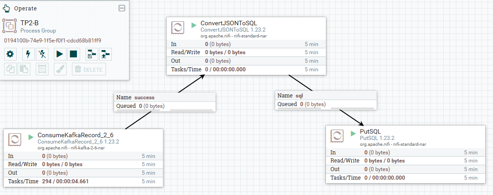

Auteur : Matthieu Ramond - M1 MIAGE Classique

[Index](./README.md)

# TP2

## BROKER
1. **Télécharger et Installer Kafka sur un seul broker**
   
   On télécharge, on extrait puis on lance kafka via zookeeper via les commandes
   ```bash
   bin/zookeeper-server-start.sh config/zookeeper.properties
   ```
   et
   ```bash
   bin/kafka-server-start.sh config/server.properties
   ```
   dans deux terminaux différents

2. **Installer Kafka en cluster de 3 brockers**
3. **Modifier la configuration de la durée de retention des messages de votre broker et mettre à 30 jours.**

    Il faut modifier le fichier `config/server.properties` et changer la valeur de `log.retention.hours` de 168 (7 jours) à 720 (30 jours)

4. **Retirer le temps de latence entre le producer et le consumers. (lors de la transition du message, lorsque le producer crée un message, kafka retiens le message avant de l'envoyer au consumer)**
   
   Il suffit de rajouter le paramètre `linger.ms=0`, que ce soit dans la commande de lancement du producer via le flag `--producer-property` ou dans le fichier de configuration en renseignant le fichier de config dans la commande via `--producer.config config/producer.properties`
   

## Les topics
1. **Créer 2 topics TP_MIAGE_1 et TP_MIAGE_2 avec 3 partitions et un facteur de réplication de 1**
    
    Commande :
    ```bash
    bin/kafka-topics.sh --create --topic TP_MIAGE_1 --partitions 3 --bootstrap-server localhost:9092
    ```
    résultat :
    ```
    Created topic TP_MIAGE_1
    ```
    commande :
    ```bash
    bin/kafka-topics.sh --create --topic TP_MIAGE_2 --partitions 3 --bootstrap-server localhost:9092
    ```
    résultat :
    ```bash
    Created topic TP_MIAGE_2
    ```

2. **Afficher les informations du topic  TP_MIAGE_1**
   
   commande :
   ```bash
   bin/kafka-topics.sh --describe --topic TP_MIAGE_1 --bootstrap-server localhost:9092
   ```
   résultat :
   ```bash
   [2024-12-29 17:08:44,319] WARN [AdminClient clientId=adminclient-1] The DescribeTopicPartitions API is not supported, using Metadata API to describe topics. (org.apache.kafka.clients.admin.KafkaAdminClient)
   Topic: TP_MIAGE_1       TopicId: yK8C5FweSGiJDLuvxlvgrA PartitionCount: 3       ReplicationFactor: 1    Configs:
           Topic: TP_MIAGE_1       Partition: 0    Leader: 0       Replicas: 0     Isr: 0  Elr: N/A        LastKnownElr: N/A
           Topic: TP_MIAGE_1       Partition: 1    Leader: 0       Replicas: 0     Isr: 0  Elr: N/A        LastKnownElr: N/A
           Topic: TP_MIAGE_1       Partition: 2    Leader: 0       Replicas: 0     Isr: 0  Elr: N/A        LastKnownElr: N/A
   ```

3. **Lister les topics créés**
   
   Commande :
   ```bash
   bin/kafka-topics.sh --list --bootstrap-server localhost:9092
   ```
   résultat
   ```bash
   TP_MIAGE_1
   TP_MIAGE_2
   ```

4. **Modifier le nombre de partitions du topic TP_MIAGE_2 à 4**
   
   Commande :
   ```bash
   bin/kafka-topics.sh --alter --topic TP_MIAGE_2 --partitions 4 --bootstrap-server localhost:9092
   ```
   Résultat : Outre un "WARN", il n'y a pas de résultat. Cependant, une exécution de la commande describe sur le TP_MIAGE_2 nous affiche bien 4 partitions
   
5. **Supprimer le topic TP_MIAGE_2**
   
   Commande :
   ```bash
   bin/kafka-topics.sh --delete --topic TP_MIAGE_2 --bootstrap-server localhost:9092
   ```

6. **Afficher la liste des topics**
   Commande :
   ```bash
   bin/kafka-topics.sh --list --bootstrap-server localhost:9092
   ```
   résultat
   ```bash
   TP_MIAGE_1
   ```

## Le Producer

1. **Créer un topic TP_MIAGE_3 avec un 1 seule partition**

    Commande :
    ```bash
    bin/kafka-topics.sh --create --topic TP_MIAGE_3 --partitions 1 --replication-factor 1 --bootstrap-server localhost:9092
    ```
    Résultat :
    ```bash
    Created topic TP_MIAGE_3.
    ```

2. **Lancer un producer sur le topic  TP_MIAGE_3**

    Commande :
    ```bash
    bin/kafka-console-producer.sh --topic TP_MIAGE_3 --bootstrap-server localhost:9092
    ```
    Résultat : Crée une interface dans laquelle nous pouvons envoyer des messages.

## Les Consummers

1. **Lancer un consommateur pour lire les messages du topic  TP_MIAGE_3**

    ```bash
    bin/kafka-console-consumer.sh --topic TP_MIAGE_3 --bootstrap-server localhost:9092
    ``` 
    Résultat : Crée une interface dans laquelle tout message envoyé par un producer dans le topic TP_MIAGE_3 est affiché (avec une seconde d'intervale entre l'envoi et la réception. Seuls les messages envoyés depuis la création du consummer sont affichés)

2. **Lancer un consommateur pour lire les messages du topic  TP_MIAGE_3 depuis le début**

    Commande :
   ```bash
   bin/kafka-console-consumer.sh --topic TP_MIAGE_3 --from-beginning --bootstrap-server localhost:9092
   ```
   Résultat : Ouvre une interface qui affiche les anciens messages du topic ainsi que les nouveaux

3. **Lancer un consommateur pour lire les messages du topic TP_MIAGE_3 à partir d'un numéro d'offset particulier**

    Pour définir un offset, on doit préciser la partition.

    Commande :
   ```bash
   bin/kafka-console-consumer.sh --topic TP_MIAGE_3 --partition 0 --offset 2 --bootstrap-server localhost:9092
   ```
   Résultat : Ouvre une interface qui affiche tous les messages à partir du troisième message (inclu)

4. **Arrêter les consumers et les producers**
   
   Il suffit de faire un ctrl + c dans chaque terminal pour fermer les consumers et les producers

## Les groupes de Consumers

1. **Créer un topic TP_MIAGE_4 avec 3 partitions**

    Commande :
    ```bash
    bin/kafka-console-consumer.sh --topic TP_MIAGE_4 --group miage_group --bootstrap-server localhost:9092
    ```
    Résulat
    ```bash
    Created topic TP_MIAGE_4.
    ```

2. **Créer un groupe de consumers sur la partition**
   
   On peut créer un groupe de consummer en indiquant le paramètre --group en lançant le consummer.

3. **Créer 3 consumers dans le groupe**
   
    Commande :
    ```bash
    bin/kafka-console-consumer.sh --topic TP_MIAGE_4 --group miage_group --bootstrap-server localhost:9092
    ```

4. **Afficher les membres du groupe**

    Commande :
    ```bash
    bin/kafka-consumer-groups.sh --describe --group miage_group --bootstrap-server localhost:9092
    ```
    Résultat :
    ```bash
    GROUP           TOPIC           PARTITION  CURRENT-OFFSET  LOG-END-OFFSET  LAG             CONSUMER-ID                                           HOST            CLIENT-ID
    miage_group     TP_MIAGE_4      1          0               0               0               console-consumer-6718841c-6e9f-4829-90bd-6d2586f9c389 /192.168.1.25   console-consumer
    miage_group     TP_MIAGE_4      2          0               0               0               console-consumer-b3e8dfcb-074c-4608-b6d2-03c5038e5170 /192.168.1.25   console-consumer
    miage_group     TP_MIAGE_4      0          0               0               0               console-consumer-2835e0ab-9a6e-4656-ad64-79b74a8444d6 /192.168.1.25   console-consumer
    ```

5. **Lancer un producer sur le topic TP_MIAGE_4 et publier 10 messages minimum**
   
    Commande : 
    ```bash
    bin/kafka-console-producer.sh --topic TP_MIAGE_4 --bootstrap-server localhost:9092
    ```
    Résultat :
    
    

6. **Qu'est ce que vous remarquez ?**

    Tous les messages finissent dans le premier consummer lancé (correspondant à la partition 0 donc)

7. **Arrêter le producer, Modifier la configuration du load balancing et mettre le mode round robin et relancer les 3 consumers du groupe puis publier 10 nouveaux messages minimum**

    Commande pour lancer le producer : 
    ```bash
    bin/kafka-console-producer.sh --topic TP_MIAGE_4 --producer-property partitioner.class=org.apache.kafka.clients.producer.RoundRobinPartitioner --bootstrap-server localhost:9092
    ```
    (on peut aussi renseigner le paramètre dans la configuration du producer en renseignant le fichier de configuration dans la commande)


    Résultat :

    

8. **Qu'est ce que vous remarquez ?**
   
   Les messages sont répartis de façon aléatoire entre les trois consummers


## NIFI et KAFKA
1. Créer un topic TP_MIAGE_5
   
    Commande :
    ```bash
    bin/kafka-topics.sh --create --topic TP_MIAGE_5 --bootstrap-server localhost:9092
    ```
    Résulat
    ```bash
    Created topic TP_MIAGE_5.
    ```

2. .
   
   

   

3. .
   
   

   